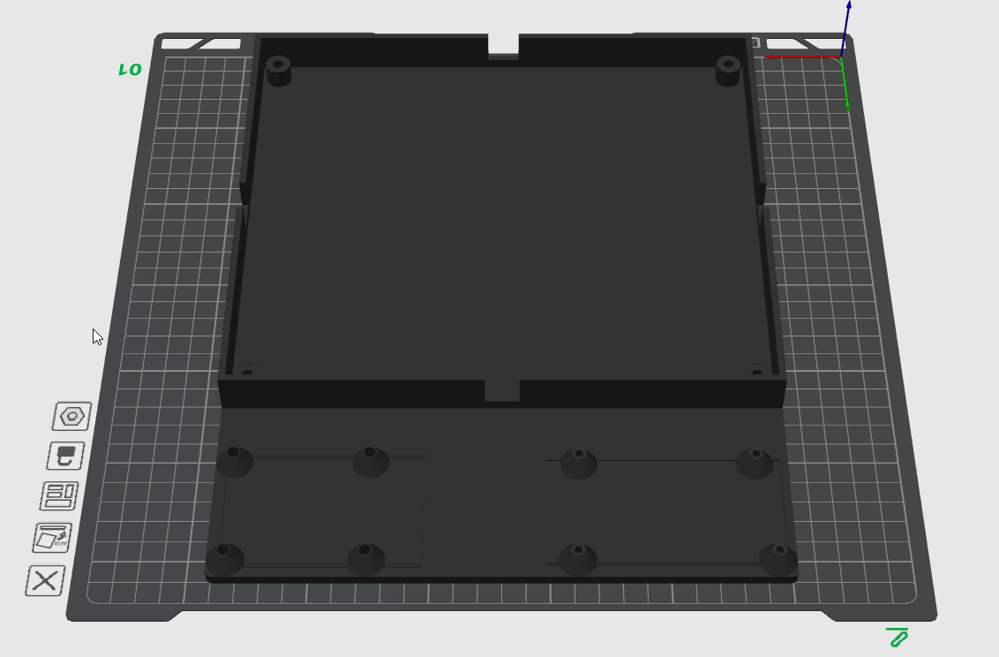

# Makeronics Breadboard Mount

A 3D-printable mounting base for the Makeronics 3220-Point Solderless Breadboard with integrated standoffs for a Raspberry Pi 5 and an Arduino GIGA R1 WiFi.



## Overview

This project provides an OpenSCAD model (`makeronics_mount.scad`) that generates a single-piece mounting plate combining:

- A recessed bay for the Makeronics 3220-point breadboard metal plate
- Standoffs and mounting holes for a Raspberry Pi 5
- Standoffs and mounting holes for an Arduino GIGA R1 WiFi

The breadboard sits in a walled recess on top; the two dev boards mount side-by-side below it, rotated 180° with USB ports facing each other for easy cable routing between them. Boards are pushed to opposite edges for maximum spacing.

## Components

### Makeronics 3220-Point Solderless Breadboard

| Spec | Value |
|------|-------|
| Manufacturer | Makeronics |
| ASIN | B07D5VN89C |
| Total test points | 3,220 |
| Terminal strips | 4 double strips (2,520 tie-points) |
| Bus strips | 7 power lanes (700 tie-points) |
| Binding posts | 4 (black, red, yellow, green) |
| Wire gauge | 20–29 AWG |
| Grid spacing | 0.1 inch |
| Housing | ABS with metal contact clips |
| Metal plate | 237 mm × 205 mm, black aluminum |


#### Mount Design

- **Screw holes:** 4 corners, Ø5 mm, centered 8 mm from each edge
- **Screw-support posts:** 10 mm tall, Ø12 mm
- **Perimeter wall:** 20 mm tall, 3 mm thick — creates a recess for the metal plate
- **Cable slots:** 15 mm wide pass-throughs on all four walls

### Raspberry Pi 5

| Spec | Value |
|------|-------|
| Board size | 85 mm × 56 mm |
| PCB thickness | 3 mm |
| Mounting holes | 4 × Ø3.0 mm |
| Hole inset | 3.5 mm from board edges |
| Hole spacing | 58 mm (H) × 49 mm (V) |
| Reserved envelope (10 mm clearance) | 105 mm × 76 mm |
| Standoff style | Cone (16 mm base, 6 mm top, 8 mm tall) |
| Orientation | Rotated 180° — USB-A ports face inward toward GIGA |
| Position | Right side of base plate |

**Mounting hole template** (top-left hole as origin):

| Hole | X (mm) | Y (mm) |
|------|--------|--------|
| Top-left | 0 | 0 |
| Top-right | 58 | 0 |
| Bottom-left | 0 | 49 |
| Bottom-right | 58 | 49 |

### Arduino GIGA R1 WiFi

| Spec | Value |
|------|-------|
| Board size | 101.60 mm × 53.34 mm |
| Mounting holes | 4 × Ø3.20 mm (asymmetric Mega form factor) |
| Standoff style | Cone (16 mm base, 6 mm top, 8 mm tall) |
| Orientation | Rotated 180° — USB-C/A ports face inward toward Pi |
| Position | Left side of base plate |
| Reserved envelope (10 mm clearance) | 122 mm × 74 mm |

**Mounting hole template** (board origin, bottom-left corner, USB on left):

| Hole | X (mm) | Y (mm) | Notes |
|------|--------|--------|-------|
| Bottom-left | 13.97 | 2.54 | Near USB |
| Bottom-right | 96.52 | 2.54 | Far end |
| Top-left | 15.24 | 50.80 | Near USB |
| Top-right | 90.17 | 50.80 | Far end |

> **Note:** The Mega form-factor holes are NOT rectangular — the X offsets differ between the top and bottom rows. This is derived from the official Arduino Eagle PCB files.

## Files

| File | Description |
|------|-------------|
| `makeronics_mount.scad` | OpenSCAD source model |
| `STL/makeronics_mount.stl` | Generated STL for 3D printing |

## Building

### Prerequisites

- [OpenSCAD](https://openscad.org/) (2021.01 or later)

### Generate STL

**GUI:** Open `makeronics_mount.scad` in OpenSCAD and use *Design → Render* (F6), then *File → Export → STL*.

**Command line:**

```bash
openscad -o makeronics_mount.stl makeronics_mount.scad
```

## Printing Summary

- **Material:** PLA or PETG
- **Total:** 174.32 m / 553.47 g
- **Layer height:** 0.2 mm
- **Infill:** 100%
- **Supports:** Not required (flat base design)
- **Orientation:** Print flat (base down)
- **Estimated cost:** ~$13.83
- **Estimated time:** ~7h 40m

## Hardware

- 4 × M5 screws + nuts (breadboard mounting)
- 4 × M3 × 8 mm screws + nuts (Raspberry Pi 5)
- 4 × M3 × 8 mm screws + nuts (Arduino GIGA R1 WiFi)
