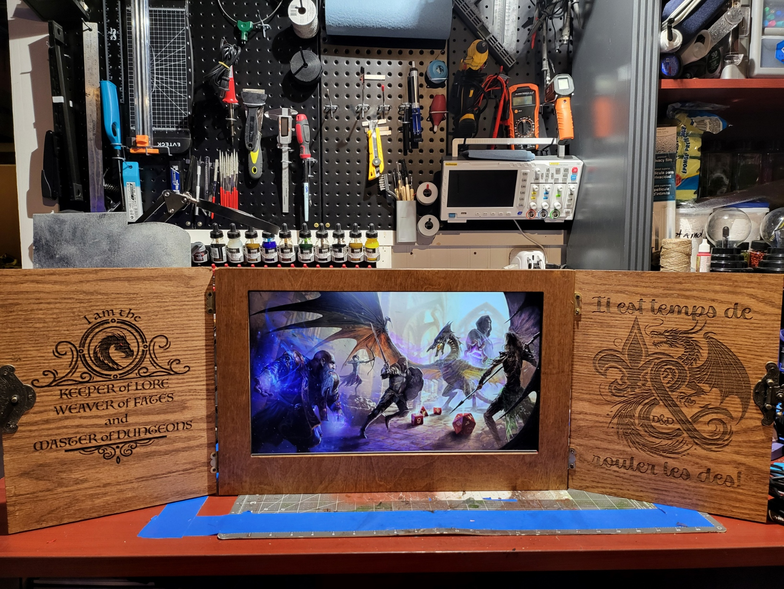

# Projects #

## GM SCREEN ##

The GM Screen project is a customizable, portable game master screen designed for tabletop role-playing games. It features 3D-printed parts, high-resolution artwork, and slots for modular inserts, making it ideal for organizing game materials and enhancing the tabletop experience.

## RETRO COMPUTER ##

The Retro Computer project is a modern recreation of classic personal computers, combining retro aesthetics with contemporary hardware. It includes 3D-printed cases, vintage-style components, and detailed documentation to help enthusiasts build and customize their own retro-inspired computing devices.

