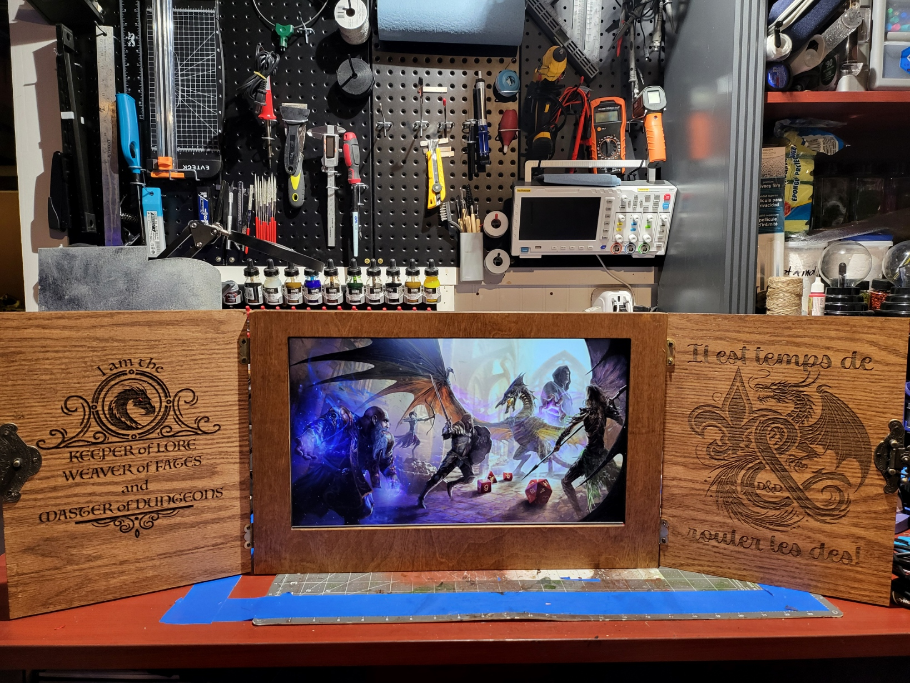
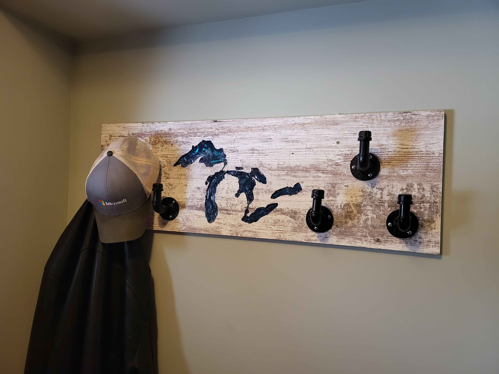
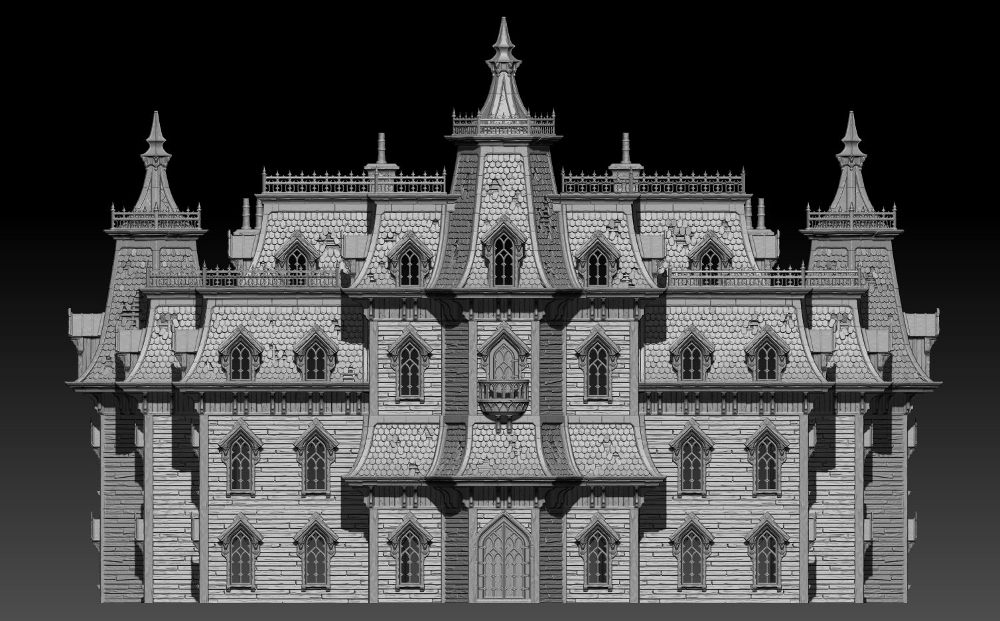
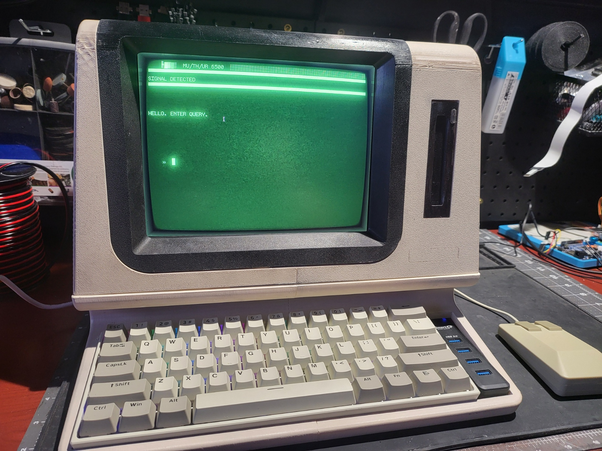
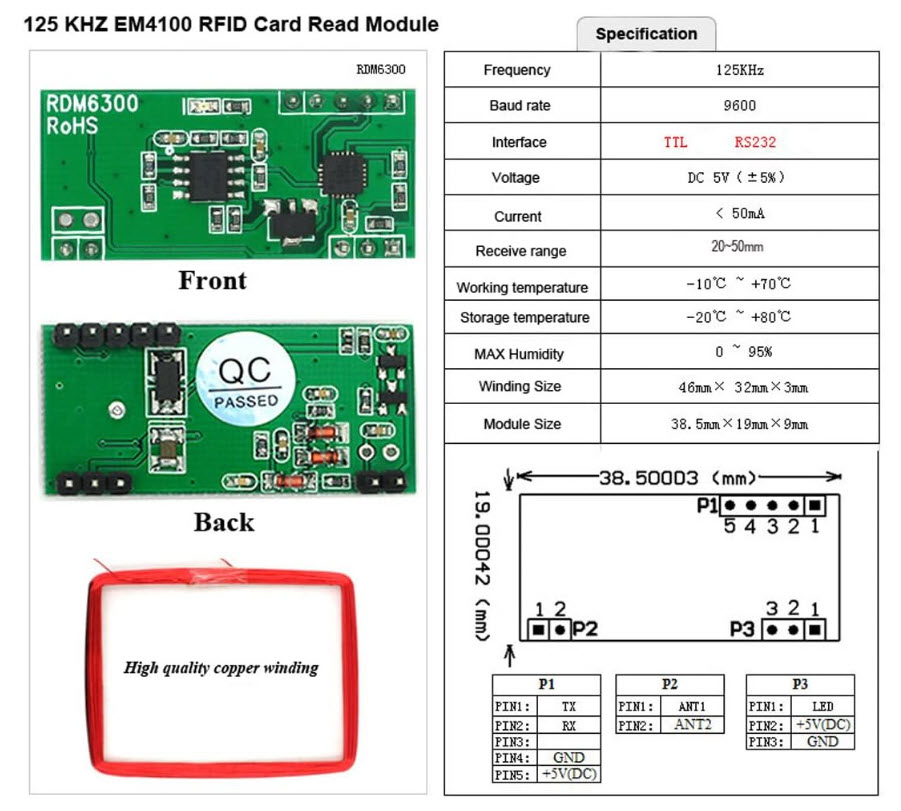

# Projects #

## GM SCREEN ##

The GM Screen project is a customizable, portable game master screen designed for tabletop role-playing games. It features 3D-printed parts, high-resolution artwork, and slots for modular inserts, making it ideal for organizing game materials and enhancing the tabletop experience.

[View Full Documentation →](GM-SCREEN/README.md)

## MICHIGAN RACK ##

A custom-designed wall rack celebrating our love for Michigan. This 3D-printed wall organizer features the iconic shape of Michigan's Lower Peninsula, combining functionality with a personal touch. Perfect for holding keys, sunglasses, or small everyday items while showcasing pride for the Great Lakes State.

[View Full Documentation →](MICHIGAN-RACK/README.md)

## BENTHEBUILDER MUG ##

A custom-designed coffee mug featuring original "BenTheBuilder" branding and artwork. This personalized mug showcases unique graphics on both front and back, perfect for morning coffee, afternoon tea, or displaying in the workshop.

[View Full Documentation →](BENTHEBUILDER-MUG/README.md)

## TERRAIN MANSION ##

The Stormcrow Mansion is a massive, modular Victorian mansion designed for tabletop RPG campaigns. This gothic masterpiece features five floors of detailed architecture with over 200 STL files, perfect for horror, mystery, or fantasy campaigns. Includes glass conservatory, towers, terraces, and extensive accessories.

[View Full Documentation →](TERRAIN-MANSION/README.md)

## RETRO COMPUTER ##

The Retro Computer project is a modern recreation of classic personal computers, combining retro aesthetics with contemporary hardware. It includes 3D-printed cases, vintage-style components, and detailed documentation to help enthusiasts build and customize their own retro-inspired computing devices.

[View Full Documentation →](RETRO-COMPUTER/README.md)

## KYBER CRYSTALS ##

A comprehensive project for understanding and creating custom kyber crystals compatible with Star Wars: Galaxy's Edge technology. This project includes extensive documentation on RFID protocols, holocron hardware, lightsaber electronics, and droid systems. Create your own crystals using 3D-printed resin shells and programmed RFID tags for use in Jedi/Sith Holocrons, Wayfinders, and Savi's Workshop lightsabers.

**Features:**

- Complete RFID tag databases for Series 1 & 2 crystals
- Hardware documentation for holocrons and lightsabers
- 3D-printable crystal designs
- RFID programming guides (Proxmark3)
- Community research and teardown galleries

[View Full Documentation →](KYBER-CRYSTALS/README.md)