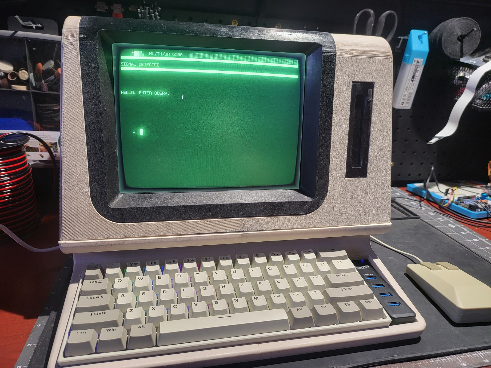

# RETRO COMPUTER #

This is a retro computer that will be used as an interactive prop for my TTRPG games. It is modeled after DEC. 

## Parts List ## 

- ([AMAZON](https://www.amazon.com/dp/B0C7Z3ZY3P?ref_=ppx_hzsearch_conn_dt_b_fed_asin_title_9&th=1)) UPERFECT 2K 144Hz Portable Gaming Monitor 18" 2560x1600 QHD 
- ([AMAZON](https://www.amazon.com/dp/B078SSL5TH?ref_=ppx_hzsearch_conn_dt_b_fed_asin_title_3&th=1)) Solid Brass Napanee Offset Cabinet Hinges
- ([HOMEDEPOT](https://www.homedepot.com/p/Columbia-Forest-Products-1-4-in-x-4-ft-x-8-ft-PureBond-Birch-Plywood-actual-0-188-in-x-48-in-x-96-in-165891/100092485)) 1/4 in. x 4 ft. x 8 ft. PureBond Birch Plywood

## STL's ## 

This folder contains the STLs that can be used to 3d Print the parts for the computer. 

([LINK](https://www.pcbway.com/project/shareproject/DEC_Mini_a_full_sized_fully_working_3D_printable_beautiful_retro_computer_af3e515a.html))

## CODE ##

This directory contains the code used to configure the Raspberry PI for retro computer. 