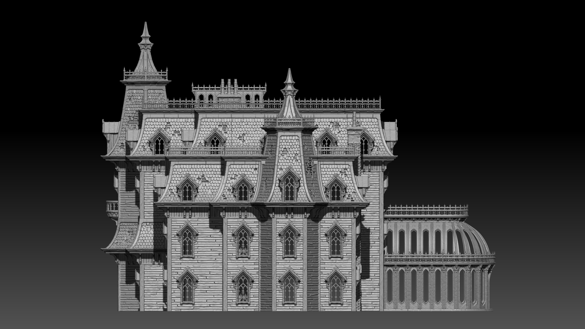
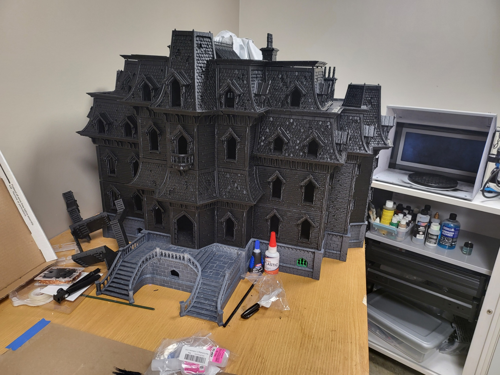
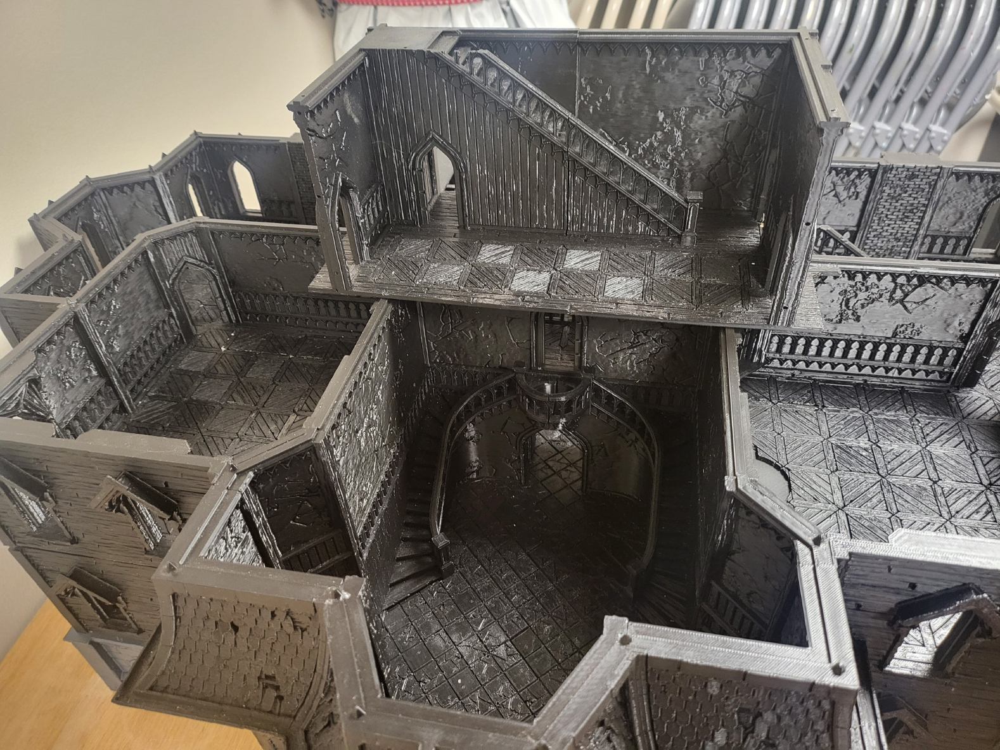
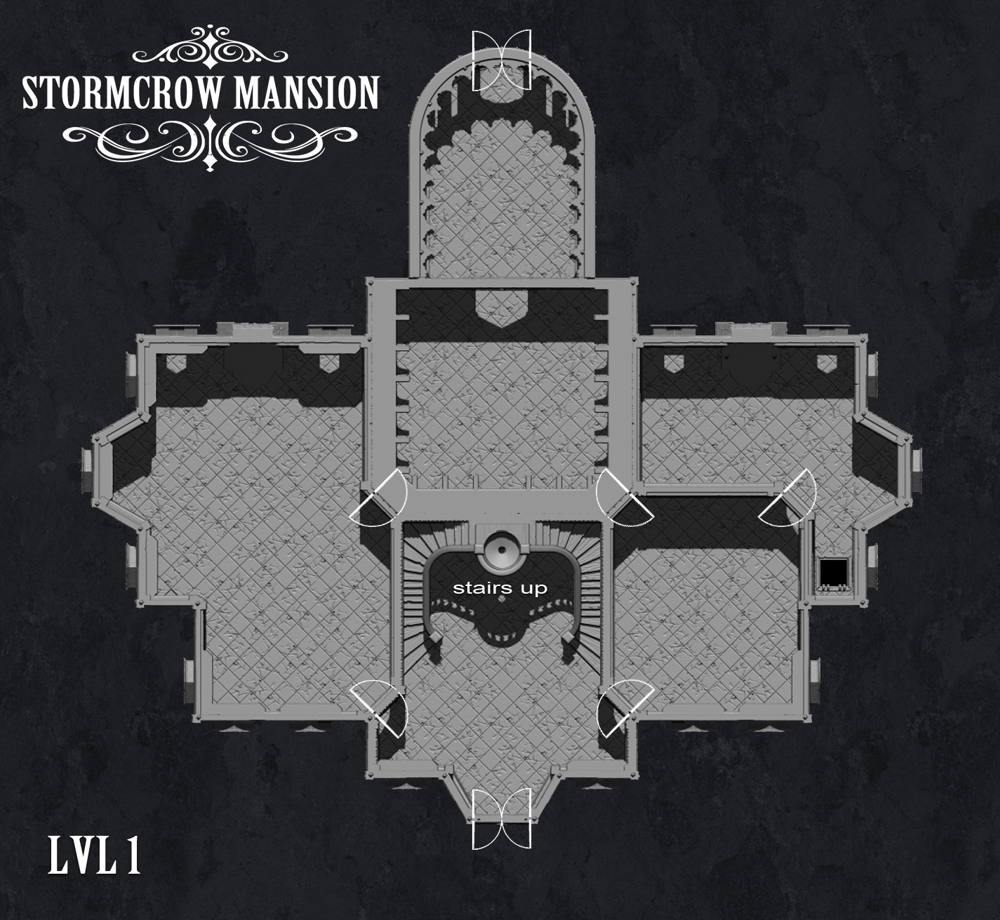
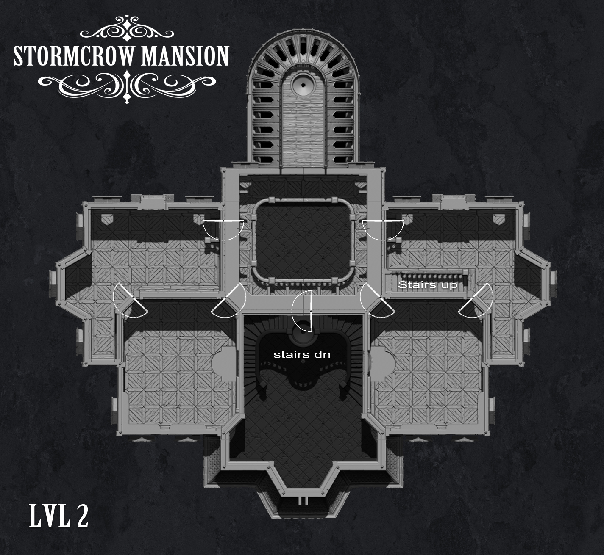
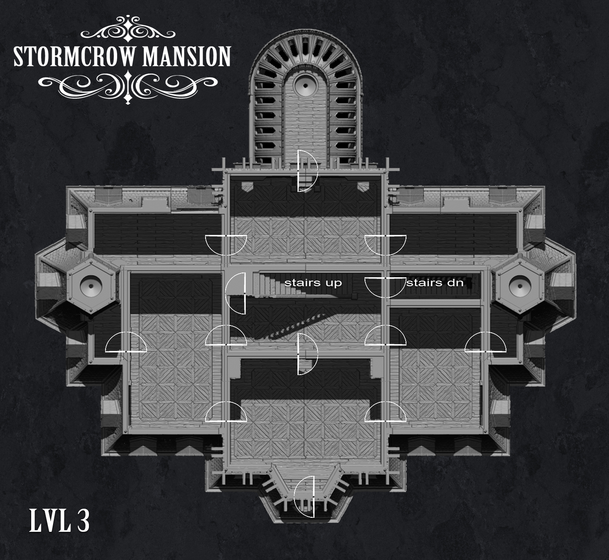
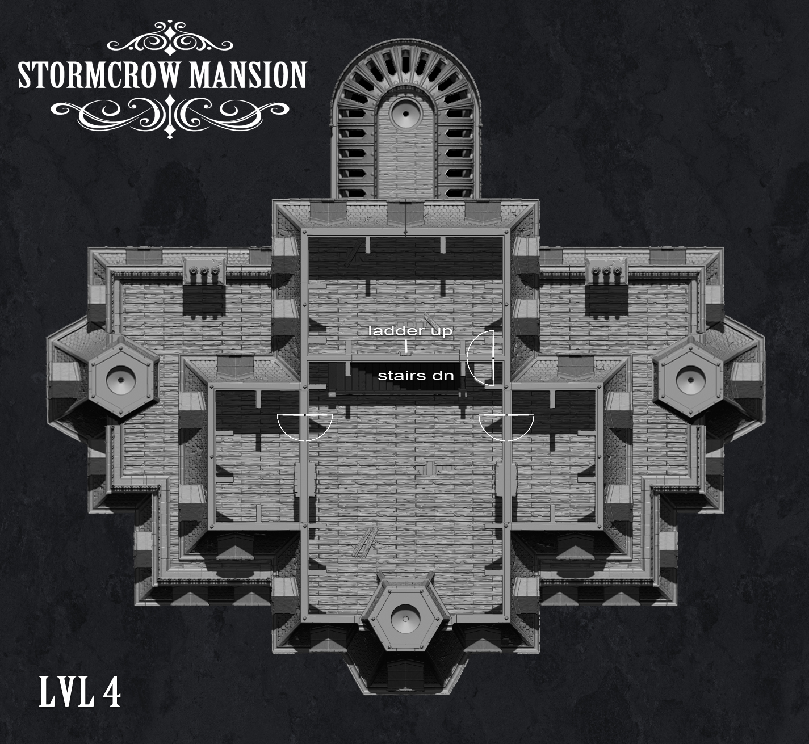
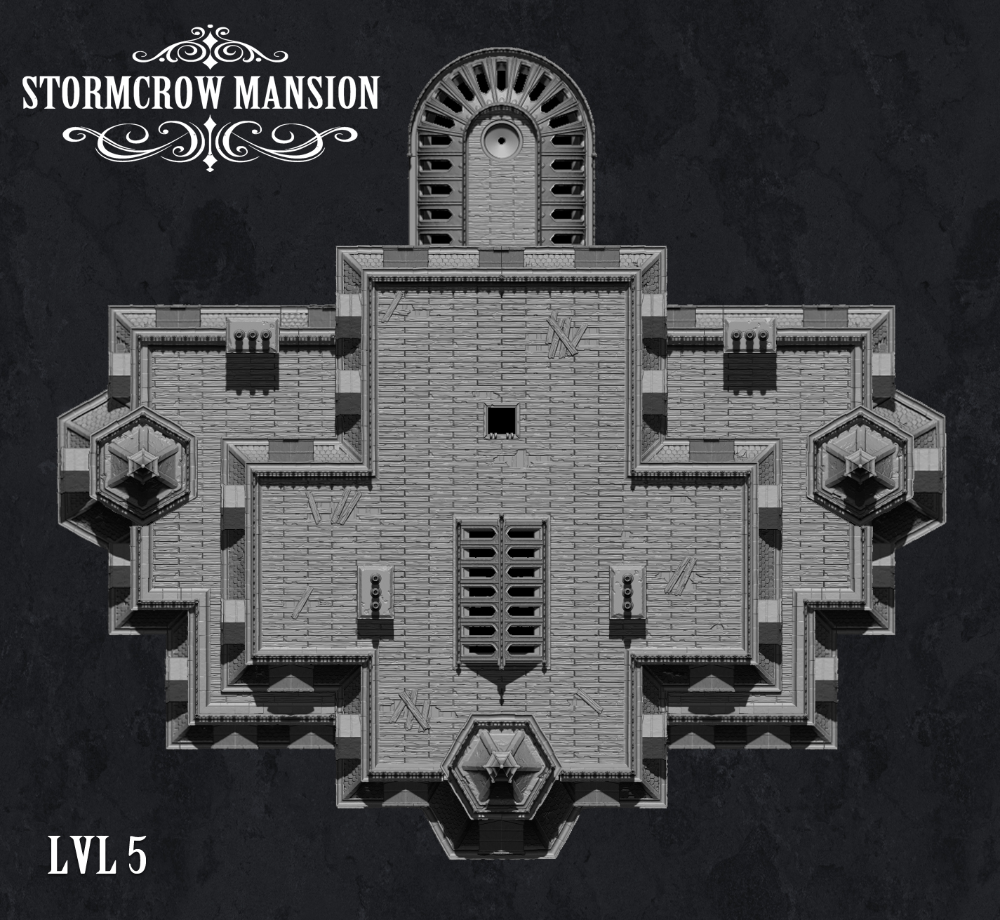

# Stormcrow Mansion - 3D Printable Tabletop Terrain

A massive, modular Victorian mansion designed for tabletop RPG campaigns. This gothic masterpiece features five floors of detailed architecture, perfect for horror, mystery, or fantasy campaigns.

## 🛒 Purchase

This model is available for purchase at [MyMiniFactory](https://www.myminifactory.com/object/3d-print-stormcrow-mansion-full-campaign-including-all-stretch-goals-214157)

## 📐 Project Overview

The Stormcrow Mansion is a multi-level, modular terrain piece featuring:

- **5 Complete Floors** with detailed interior rooms
- **Victorian Gothic Architecture** with towers, terraces, and ornate details
- **Glass Conservatory** with removable roof sections
- **Extensive Accessories** including furniture, decorations, and atmospheric details

## 🖼️ Gallery

### Complete Views

*The imposing front facade of Stormcrow Mansion*

*Side elevation showing the full height and architectural detail*

### Work in Progress

### Floor Plans

#### Level 1 - Ground Floor

*Grand lobby, library, dining room, drawing room, and kitchen*

#### Level 2 - First Floor

*East and west wing bedrooms with connecting hallways*

#### Level 3 - Second Floor

*Additional bedrooms and roof access*

#### Level 4 - Tower Level

*Tower rooms and terraces*

#### Level 5 - Attic & Spires

*Top floor with skylight and decorative crests*

## 📁 Project Structure

### Main Components

- **Conservatory/** - Glass conservatory with LED lighting capabilities
- **Mansion_LVL1/** - Ground floor (35+ pieces including library, dining, drawing rooms, kitchen)
- **Mansion_LVL2/** - First floor (27 pieces with east/west wing bedrooms)
- **Mansion_LVL3/** - Second floor (40+ pieces with roof sections)
- **Mansion_LVL4/** - Tower level (31 pieces with towers and terraces)
- **Mansion_LVL5/** - Attic level (17 pieces with skylight)
- **Miscellaneous/** - Accessories and optional parts

### Miscellaneous Accessories

- **Crows/** - Decorative ravens (2 variants)
- **Curtains/** - Modular curtain units for windows
- **Decorations/** - Picture frames, candelabras, wall sconces
- **Fireplaces/** - 3 fireplace variants
- **LibraryShelves/** - 8 bookshelf variants (empty + filled options)
- **Windows_Doors/** - Window inserts, glass templates, doors, trapdoor

## 🔧 Printing Notes

### Print Settings
- **Layer Height:** 0.2mm recommended (0.15mm for fine details)
- **Infill:** 10-15% for walls, 20% for load-bearing pieces
- **Supports:** Some pieces include pre-supported versions (FDM and resin)
- **Scale:** Designed for 28-32mm miniatures

### Material Requirements
- **Estimated Print Time:** 300+ hours for complete mansion
- **Estimated Filament:** 5-7kg depending on settings
- **Recommended Materials:** PLA, PLA+, or PETG

### Assembly
- Refer to **StormcrowMansion_AssemblyGuide.pdf** for detailed instructions
- Individual assembly guides included in each level folder
- Optional: Use magnets or OpenLOCK connectors for modular assembly
- LED covers provided for optional lighting effects

## 📋 File Count Summary

| Component | STL Files | Assembly Guides |
|-----------|-----------|-----------------|
| Conservatory | 11 | 1 |
| Level 1 | 35 | 1 |
| Level 2 | 27 | 1 |
| Level 3 | 42 | 2 |
| Level 4 | 31 | 1 |
| Level 5 | 17 | 1 |
| Miscellaneous | 40+ | - |
| **Total** | **200+ STL files** | **7 guides** |

## 🎨 Painting & Finishing

The mansion is designed with texture and detail that works well with:
- Drybrushing techniques for stone and wood
- Washes for shadows and depth
- Optional LED lighting through LED covers
- Glass/clear resin for conservatory windows

## 📜 License & Attribution

This is a commercial model by **Stormcrow Scenery**.  
Purchase and licensing information available at [MyMiniFactory](https://www.myminifactory.com/object/3d-print-stormcrow-mansion-full-campaign-including-all-stretch-goals-214157)

## 🎲 Perfect For

- **Call of Cthulhu** - Victorian horror investigations
- **Dungeons & Dragons** - Haunted mansion adventures
- **Vampire: The Masquerade** - Gothic vampire domains
- **Murder Mystery Campaigns** - Clue-style gameplay
- **Display Piece** - Impressive painted showpiece

---

*A truly epic terrain project for dedicated tabletop enthusiasts* 🏰
